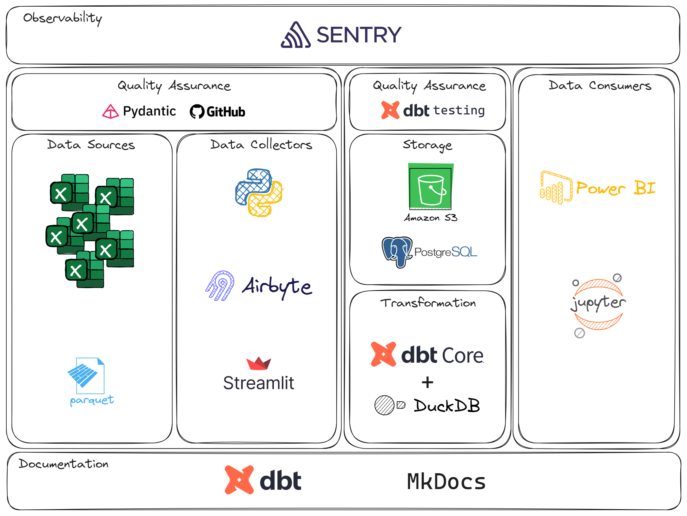

# Project Overview



This project utilizes DuckDB as a local database for development purposes. The raw data for this project comprises several .csv files, totaling 2GB, which have been converted to parquet files due the size and processing speed (columnar format). All files will be loaded with a Streamlit frontend using Pydantic for data governance (contract). This process will be orchestrated using Airbyte and Python. To change the contract, it will need an approval in the GitHub repo. To ensure that everyone have the same contract, it will be implemented an CI/CD process.

Following this, the project leverages dbt (data build tool) to retrieve data from the AWS S3 Bucket, perform transformations, and load it into a PostgreSQL for production. Additionally, dbt is responsible for generating a local documentation covering all transformations, schemas, tests, and other relevant information within this layer of the project.

## TODO List
- :white_check_mark: **Create the pydantic GitHub repo with Branch Protection**: Establish the pydantic GitHub repository with Branch Protection; contract modifications require approval.
- :white_check_mark: **Create the pydantic contract**: Define the pydantic contract to govern data handling within the project.
- :white_check_mark: **Create the CI/CD for the contract**: Develop the CI/CD process in the contract GitHub repository.
    - :white_check_mark: Add the contract as a submodule to the main repo.
    - :white_check_mark: Configure the CI/CD using the GitHub Actions.
    - :white_check_mark: Test the Workflow.
- :white_check_mark: **Add Sentry as the Observability tool**: Add Sentry to the project
- :white_check_mark: **Create the Streamlit page to upload CSV files**: Develop a Streamlit page to streamline the process of uploading CSV files.
    - :white_check_mark: Create the streamlit frontend to upload files
    - :white_check_mark: Create the backend to process the uploaded csv files and check if the schema are corret using the pydantic contract
    - :white_check_mark: Create the app.py to execute the application
    - :white_check_mark: Test the upload
- :white_check_mark: **Transform the CSV files into Parquet files**: Implement the necessary procedures to transform CSV files into Parquet files.
- :white_check_mark: **Save the Parquet files into AWS S3 Bucket**: Set up mechanisms to save the Parquet files into the designated AWS S3 Bucket.
- [ ] **Establish the dbt project**: Initiate the creation of the dbt project for seamless data management.
- [ ] **Extract data from AWS S3 Bucket Parquet files into DuckDB using dbt**: Utilize dbt to extract and process data from AWS S3 Bucket Parquet files into DuckDB.
- [ ] **Create the transactions table from the appended files**: Develop the transactions table based on the processed files.
- [ ] **Create the transaction table within the dbt project**: Establish the transaction table structure within the dbt project.
- [ ] **Define the transaction table schema in the dbt project (including tests for each column)**: Specify the schema for the transaction table in the dbt project, including comprehensive tests for each column.
- [ ] **Export the transactions table to a Parquet file in the AWS S3 Bucket**: Implement procedures to export the transactions table to a Parquet file within the AWS S3 Bucket.
- [ ] **Initial testing and building of the dbt project**: Conduct initial testing and building phases for the dbt project.
- [ ] **Decompose the transaction table into Fact and Dimension tables**: Break down the transaction table into separate Fact and Dimension tables.
- [ ] **Create schemas for Fact and Dimension tables in the dbt project (including tests for each column)**: Develop schemas for Fact and Dimension tables within the dbt project, accompanied by thorough tests for each column.
- [ ] **Second round of testing and building for the dbt project**: Conduct a second round of testing and building for the dbt project.
- [ ] **Load the Fact and Dimension tables into PostgreSQL**: Implement processes to load the Fact and Dimension tables into PostgreSQL.
- [ ] **Update dbt documentation with comprehensive details related to the project**: Enhance the dbt documentation with detailed information regarding the entire project.
- [ ] **Publish the dbt documentation on GitHub Pages**: Make the dbt documentation accessible by publishing it on GitHub Pages.
- [ ] **Create a PowerBI Dashboard using the data**: Develop a PowerBI Dashboard utilizing the processed data.
- [ ] **Create a Jupyter Notebook using the data**: Generate a Jupyter Notebook incorporating the processed data.


To use this project structure you will need to follow the steps below.

# Requirements
To use this project properly, you will need to install:
- [python](https://www.python.org/downloads/)
- [git](https://git-scm.com/downloads)
- [pyenv](https://pypi.org/project/pyenv/)
- [poetry](https://python-poetry.org/)

To install and configure Pyenv and Poetry in Windows, check [this video](https://www.youtube.com/watch?v=547Jr26duHQ&pp=ygUgaG93IHRvIGluc3RhbGwgcG9ldHJ5IGluIHdpbmRvd3M%3D).
To learn how to manage multiple python versions using pyenv, check [this article](https://realpython.com/intro-to-pyenv/).

# Poetry local environment config

To create the .venv local folder, type in terminal:
*for this project only, add the argument --local at the end of the command. Below is the poetry global settings.
```bash
poetry config virtualenvs.create true
poetry config virtualenvs.in-project true
```

For other OS, check it: [duckdb download page](https://duckdb.org/docs/installation/index?version=latest&environment=cli&installer=binary&platform=win)

# DuckDB install
Windows:
```bash
winget install DuckDB.cli
```

# Installation Steps

## Git Clone
Open a terminal window (cmd, bash, or anything with git commands) and type:
```bash
git clone https://github.com/alanceloth/dataWarehouseLowBudget.git
cd dataWarehouseLowBudget
git init
```

## Create new GitHub Repo from existing one
In the terminal window, type:
```bash
gh repo create
```
Choose the third option: Push an existing local repository to GitHub.
Choose the current path (just put a dot "." and hit enter)
Follow the instructions on screen, add a remote called 'master', and that's it!

## Setting up the environment
We will need python 3.11.5, and to get this version we will use pyenv.
In the same terminal window, type:

If you never used pyenv, or if you don't have the 3.11.5 version in your pyenv:
```bash
pyenv update
pyenv install --l
```

If you find the 3.11.5, then it's everything correct.
```bash
pyenv install 3.11.5
```

To check the python versions installed, use this:
```bash
pyenv versions
```

You will notice that one of the versions will have a * symbol. This indicates that the system is using this version.
You can also check the default python version used by the system with this:
```bash
which python
```

If you have the 3.11.5 version in your pyenv:
To use the project python version (3.11.5), use the command below:
```bash
pyenv local 3.11.5
```

## Poetry

To initialize the poetry in the project, type in the terminal:
```bash
poetry env use 3.11.5
poetry shell
poetry install --no-root
```

## Testing

In the terminal:
```bash
duckdb
```

If the above code don't work properly, go to the [duckdb download page](https://duckdb.org/docs/installation/index?version=latest&environment=cli&installer=binary&platform=win) and get the latest zip file. Extract the duckdb.exe and put inside your project folder. This will allow you to use the duckdb in the terminal.


# Help

Manual contract update using submodule:

```bash
# At the submodule directory
cd contract

# Update to the most recent version
git pull origin master

# Back to the main directory
cd ..

# Confirm the updates at the main repo
git add contract
git commit -m "Update contract"
git push origin master

```


# Contact

LinkedIn: [Alan Lanceloth Rodrigues Silva](https://www.linkedin.com/in/alanlanceloth/)

E-mail: [alan.lanceloth@gmail.com](mailto:alan.lanceloth@gmail.com)
